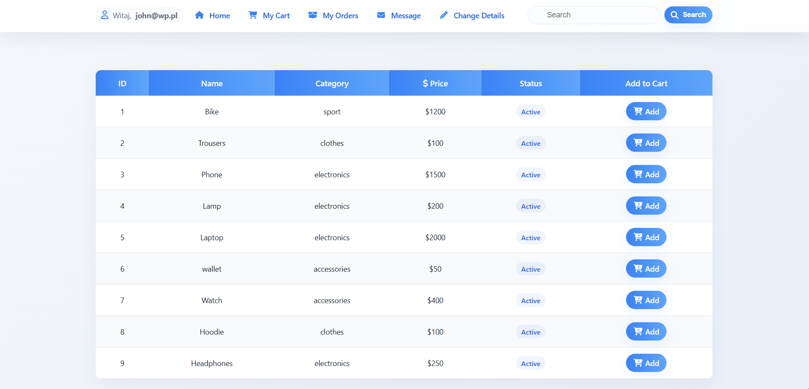
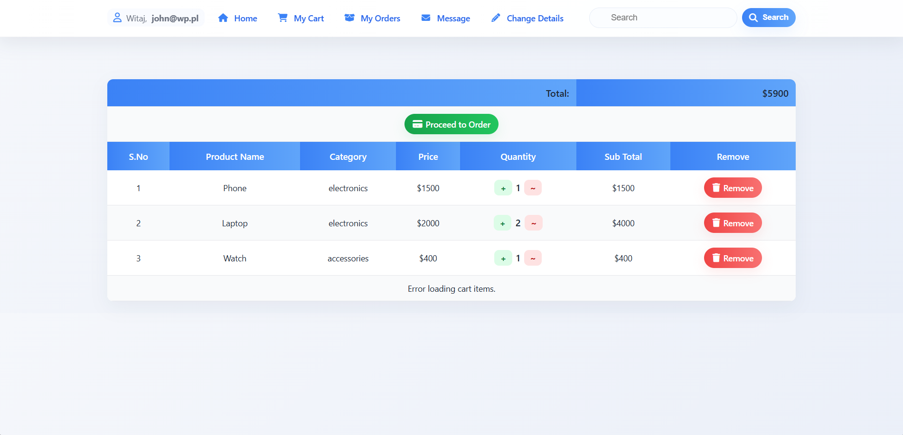
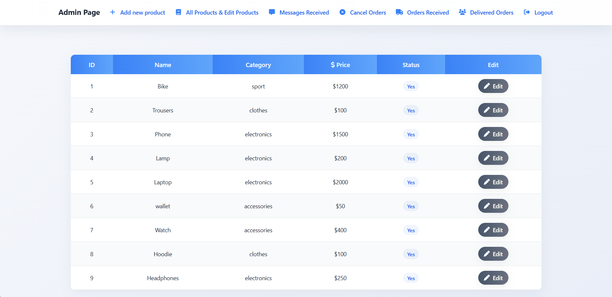

# 🛒 Internetowy Sklep – Java / JSP / Tomcat / PostgreSQL

Projekt sklepu internetowego stworzony w technologii **Java EE** z wykorzystaniem **JSP**,**Apache Tomcat** oraz **PostgreSQL** jako bazy danych.  
Aplikacja umożliwia przeglądanie produktów, dodawanie ich do koszyka, składanie zamówień oraz zarządzanie nimi w panelu administracyjnym.

---

## 📸 Zrzuty ekranu
> - Ekran główny  
>   
> - Koszyk użytkownika  
>   
> - Panel administratora  
>   

---

## 🚀 Funkcjonalności

- 🔍 Przeglądanie listy produktów (wyszukiwanie, filtrowanie)
- 🛍️ Dodawanie produktów do koszyka i składanie zamówień
- 👤 Logowanie i rejestracja użytkowników
- 🧾 Historia zamówień
- 🛠️ Panel administracyjny (CRUD produktów, zarządzanie zamówieniami)
- 💾 Integracja z bazą danych **PostgreSQL**

---

## ⚙️ Stos technologiczny

| Warstwa | Technologia |
|----------|--------------|
| Backend  | Java EE, JSP |
| Frontend | HTML5, CSS3,|
| Serwer   | Apache Tomcat 10 |
| Baza danych | PostgreSQL |

---

## 🧩 Struktura projektu

